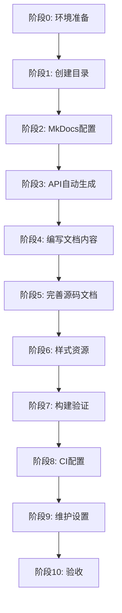

# 任务清单：API 文档生成器（api-doc-generator）

## 阶段 0：环境准备

- [ ] **0.1** 确认 Python 环境版本 ≥ 3.8
- [ ] **0.2** 创建 `requirements-docs.txt` 文档工具依赖
  ```txt
  mkdocs>=1.5.0
  mkdocs-material>=9.4.0
  mkdocstrings>=0.24.0
  mkdocstrings-python>=1.7.0
  mkdocs-gen-files>=0.5.0
  mkdocs-literate-nav>=0.6.0
  mkdocs-section-index>=0.3.0
  pymdown-extensions>=10.0
  ```
- [ ] **0.3** 安装文档依赖：`pip install -r requirements-docs.txt`
- [ ] **0.4** 验证安装：`mkdocs --version`

## 阶段 1：创建文档目录结构

- [ ] **1.1** 创建文档源文件目录 `docs/`
- [ ] **1.2** 创建子目录结构
  - `docs/api/` - API 参考文档
  - `docs/api/scripts/`
  - `docs/api/demos/`
  - `docs/api/data-analysis/`
  - `docs/mcp/` - MCP 服务文档
  - `docs/guides/` - 使用指南
  - `docs/assets/` - 静态资源
  - `docs/assets/images/`
  - `docs/assets/stylesheets/`
- [ ] **1.3** 创建 `.gitignore` 规则忽略构建目录
  ```gitignore
  # 文档构建产物
  site/
  ```

## 阶段 2：MkDocs 配置

### 2.1 主配置文件

- [ ] **2.1.1** 创建 `mkdocs.yml` 基础配置
  - 设置站点基本信息（名称、描述、作者）
  - 配置仓库链接
- [ ] **2.1.2** 配置 Material 主题
  - 颜色方案（亮/暗模式）
  - 功能特性（导航、搜索等）
  - 图标和 Logo
- [ ] **2.1.3** 配置插件
  - search（中英文搜索）
  - mkdocstrings（API 文档生成）
  - gen-files（动态生成页面）
  - literate-nav（导航管理）
  - section-index
- [ ] **2.1.4** 配置 Markdown 扩展
  - admonition、details、superfences
  - highlight、inlinehilite
  - tabbed、tasklist、tables
  - toc

### 2.2 mkdocstrings 配置

- [ ] **2.2.1** 配置 Python handler
  - 设置源码搜索路径
  - 选择 docstring 风格（Google）
  - 配置显示选项（签名、类型注解等）
- [ ] **2.2.2** 测试基本文档生成
  ```bash
  mkdocs serve
  ```

## 阶段 3：API 文档自动生成

- [ ] **3.1** 创建 `scripts/gen_ref_pages.py` 生成脚本
  - 扫描源代码目录
  - 为每个模块生成对应的 Markdown 页面
  - 生成导航结构
- [ ] **3.2** 配置源代码目录映射
  | 源目录 | 文档目录 |
  |--------|----------|
  | scripts/ | docs/api/scripts/ |
  | demos/ | docs/api/demos/ |
  | data-analysis/ | docs/api/data-analysis/ |
- [ ] **3.3** 测试自动生成功能
  - 运行 `mkdocs build`
  - 检查生成的页面是否正确
- [ ] **3.4** 创建 API 概览页面 `docs/api/index.md`
  - 模块列表
  - 快速链接
  - 搜索提示

## 阶段 4：编写核心文档内容

### 4.1 首页和入门

- [ ] **4.1.1** 创建 `docs/index.md` 首页
  - 项目简介
  - 功能特性
  - 快速链接
- [ ] **4.1.2** 创建 `docs/installation.md` 安装指南
  - 环境要求
  - 安装步骤
  - 验证安装
- [ ] **4.1.3** 创建 `docs/getting-started.md` 快速入门
  - 基本使用流程
  - 简单示例

### 4.2 MCP 服务文档

- [ ] **4.2.1** 创建 `docs/mcp/overview.md` MCP 概览
  - 什么是 MCP
  - 服务列表
  - 通用使用方式
- [ ] **4.2.2** 创建 `docs/mcp/weather-mcp.md`
  - 服务说明
  - 可用工具列表
  - 参数和返回值
  - 示例代码
  - 配置说明
- [ ] **4.2.3** 创建 `docs/mcp/demo-resources-mcp.md`
  - 按 4.2.2 模板编写
- [ ] **4.2.4** 创建 `docs/mcp/custom-tools-mcp.md`
  - 按 4.2.2 模板编写

### 4.3 使用指南

- [ ] **4.3.1** 创建 `docs/guides/docstring-style.md`
  - Google 风格规范说明
  - 各类 docstring 模板
  - 常见错误示例
- [ ] **4.3.2** 创建 `docs/guides/type-hints.md`
  - 类型注解基础
  - 常用类型
  - 最佳实践
- [ ] **4.3.3** 创建 `docs/guides/contributing.md`
  - 贡献流程
  - 代码规范
  - 提交要求

## 阶段 5：完善源代码文档

### 5.1 scripts/ 模块

- [ ] **5.1.1** 完善 `file_utils.py` docstring
  - 模块级 docstring
  - 所有公开函数的完整文档
  - 添加示例代码
  - 添加类型注解
- [ ] **5.1.2** 完善 `data_processor.py` docstring
- [ ] **5.1.3** 完善 `xml_tag_validator.py` docstring
- [ ] **5.1.4** 完善其他 scripts 模块

### 5.2 demos/ 模块

- [ ] **5.2.1** 完善 `calculator.py` docstring
- [ ] **5.2.2** 完善其他 demos 模块

### 5.3 data-analysis/ 模块

- [ ] **5.3.1** 完善 `analyze_sample_data.py` docstring
- [ ] **5.3.2** 完善其他数据分析模块

### 5.4 MCP 服务器代码

- [ ] **5.4.1** 完善 `weather-mcp-server/server.py` docstring
- [ ] **5.4.2** 完善 `demo-resources-mcp/` 代码文档
- [ ] **5.4.3** 完善 `custom-tools-mcp/server.py` docstring

## 阶段 6：样式和资源

- [ ] **6.1** 创建 `docs/assets/stylesheets/extra.css`
  - 自定义样式覆盖
  - 中文字体优化
  - 代码块样式
- [ ] **6.2** 准备 Logo 和图标
  - 项目 Logo（可选）
  - Favicon
- [ ] **6.3** 准备示例图片（如有需要）

## 阶段 7：构建和验证

- [ ] **7.1** 本地构建测试
  ```bash
  mkdocs build --strict
  ```
- [ ] **7.2** 检查构建警告和错误
  - 修复缺失的引用
  - 修复无效的链接
- [ ] **7.3** 本地预览
  ```bash
  mkdocs serve
  ```
  访问 http://127.0.0.1:8000 查看效果
- [ ] **7.4** 验证功能
  - [ ] 搜索功能正常
  - [ ] 导航结构正确
  - [ ] 代码高亮正常
  - [ ] API 文档内容完整
  - [ ] 暗色模式切换正常
  - [ ] 移动端适配

## 阶段 8：CI/CD 配置

### 8.1 GitHub Actions 配置

- [ ] **8.1.1** 创建 `.github/workflows/docs.yml`
  - 触发条件配置
  - Python 环境设置
  - 文档构建步骤
- [ ] **8.1.2** 配置 GitHub Pages 部署
  - 设置 permissions
  - 配置部署 job
- [ ] **8.1.3** 配置仓库 Settings
  - 启用 GitHub Pages
  - 设置 Source 为 GitHub Actions

### 8.2 验证 CI 流程

- [ ] **8.2.1** 创建测试 PR 触发构建
- [ ] **8.2.2** 验证构建成功
- [ ] **8.2.3** 合并后验证部署成功
- [ ] **8.2.4** 访问部署的文档站点

## 阶段 9：文档维护设置

### 9.1 版本管理（可选）

- [ ] **9.1.1** 安装 mike：`pip install mike`
- [ ] **9.1.2** 初始化版本
  ```bash
  mike deploy --push --update-aliases 1.0.0 latest
  mike set-default --push latest
  ```
- [ ] **9.1.3** 更新 mkdocs.yml 版本配置

### 9.2 维护指南

- [ ] **9.2.1** 创建 `docs/README.md`（文档维护指南）
  - 如何本地构建
  - 如何添加新页面
  - 如何更新 API 文档
- [ ] **9.2.2** 更新项目 `README.md`
  - 添加文档站点链接
  - 添加文档状态徽章

## 阶段 10：验收和收尾

- [ ] **10.1** 验收检查清单
  - [ ] 所有页面可访问
  - [ ] 搜索功能正常
  - [ ] API 文档完整（覆盖率 ≥ 90%）
  - [ ] MCP 服务文档完整
  - [ ] 使用指南完整
  - [ ] CI/CD 流程正常
  - [ ] 文档站点已上线
- [ ] **10.2** 团队反馈收集
  - 分享文档站点给团队
  - 收集改进建议
- [ ] **10.3** 后续优化计划
  - 记录需要改进的点
  - 规划下一版本更新

---

## 任务执行顺序建议



## 关键里程碑

| 里程碑 | 完成标志 | 预计时间 |
|--------|----------|----------|
| M1: 框架就绪 | 阶段 0-2 完成，能运行 `mkdocs serve` | 3 小时 |
| M2: 自动生成 | 阶段 3 完成，API 页面自动生成 | 1 小时 |
| M3: 内容完成 | 阶段 4-5 完成，所有文档内容就位 | 10 小时 |
| M4: 本地可用 | 阶段 6-7 完成，本地站点完整可用 | 2 小时 |
| M5: 线上部署 | 阶段 8-10 完成，GitHub Pages 上线 | 2 小时 |

## 文档质量检查点

- [ ] **检查点 1**（阶段 3 后）：API 文档能正确显示函数签名和参数
- [ ] **检查点 2**（阶段 5 后）：docstring 覆盖率 ≥ 90%
- [ ] **检查点 3**（阶段 7 后）：`mkdocs build --strict` 无警告
- [ ] **检查点 4**（阶段 8 后）：CI 构建成功且站点可访问

## 常见问题预防

| 问题 | 预防措施 |
|------|----------|
| mkdocstrings 找不到模块 | 确保 paths 配置正确，检查 `__init__.py` |
| 中文搜索不工作 | 配置 search 插件的 lang 参数 |
| 构建时警告多 | 使用 `--strict` 模式，逐个修复 |
| GitHub Pages 404 | 检查 base_url 和仓库名称配置 |

---

**预计总工作量**：18 小时
**建议执行方式**：按阶段顺序执行，里程碑验证
**创建日期**：2026-03-04
