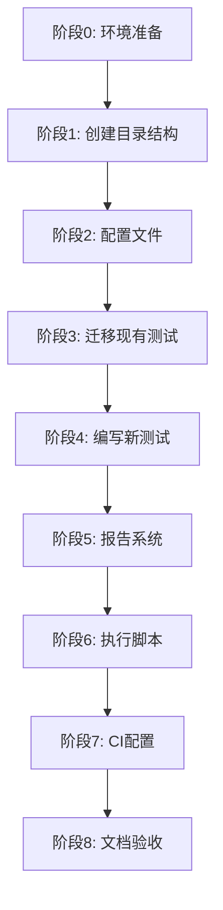

# 任务清单：自动化测试框架（auto-test-framework）

## 阶段 0：环境准备

- [ ] **0.1** 确认 Python 环境版本 ≥ 3.8
- [ ] **0.2** 创建/更新 requirements-test.txt 添加测试依赖
  ```txt
  pytest>=7.0.0
  pytest-cov>=4.0.0
  pytest-html>=4.0.0
  pytest-xdist>=3.0.0
  pytest-mock>=3.10.0
  pytest-timeout>=2.1.0
  pytest-watch>=4.2.0  # 可选：监听模式
  ```
- [ ] **0.3** 安装测试依赖：`pip install -r requirements-test.txt`
- [ ] **0.4** 验证安装：`pytest --version`

## 阶段 1：创建测试目录结构

- [ ] **1.1** 创建测试根目录 `tests/`
- [ ] **1.2** 创建测试子目录
  - `tests/unit/`
  - `tests/integration/`
  - `tests/e2e/`
  - `tests/data/fixtures/`
  - `tests/data/mocks/`
  - `tests/data/golden/`
- [ ] **1.3** 在每个测试目录创建 `__init__.py` 文件
- [ ] **1.4** 创建测试报告目录
  - `test-reports/results/`
  - `test-reports/coverage/`
  - `test-reports/archive/`
- [ ] **1.5** 添加 `.gitkeep` 到空目录保持目录结构

## 阶段 2：配置文件创建

- [ ] **2.1** 创建 `pytest.ini` 配置文件
  - 配置测试发现规则
  - 注册自定义标记（unit、integration、e2e、slow、mcp）
  - 配置输出格式和日志
- [ ] **2.2** 创建 `tests/conftest.py` 全局 Fixtures
  - 添加项目路径到 sys.path
  - 创建通用 fixtures（temp_dir、sample_data 等）
  - 创建 mock fixtures（mock_mcp_server、mock_http_client）
  - 配置自动标记功能
- [ ] **2.3** 创建 `.coveragerc` 覆盖率配置
  - 指定源代码目录
  - 配置排除规则
  - 设置最低覆盖率阈值 70%
- [ ] **2.4** 更新 `.gitignore` 添加测试产物
  ```gitignore
  # 测试产物
  .pytest_cache/
  .coverage
  test-reports/results/
  test-reports/coverage/
  *.pyc
  __pycache__/
  ```

## 阶段 3：迁移现有测试文件

### 3.1 迁移 test_demo.py

- [ ] **3.1.1** 复制 `test_demo.py` 到 `tests/unit/test_demo.py`
- [ ] **3.1.2** 重构为 pytest 风格
  - 移除 unittest.TestCase 继承（如有）
  - 使用 pytest fixtures 替代 setUp/tearDown
  - 使用 pytest.raises 替代 assertRaises
- [ ] **3.1.3** 修复 import 路径问题
  - 依赖 conftest.py 中的 sys.path 配置
  - 验证 `from demos.demo import Calculator` 可用
- [ ] **3.1.4** 运行验证：`pytest tests/unit/test_demo.py -v`

### 3.2 迁移 test_calculator_skill.py

- [ ] **3.2.1** 复制到 `tests/unit/test_calculator_skill.py`
- [ ] **3.2.2** 重构为 pytest 风格
- [ ] **3.2.3** 添加参数化测试用例
- [ ] **3.2.4** 运行验证

### 3.3 迁移 test_skills.py

- [ ] **3.3.1** 复制到 `tests/unit/test_skills.py`
- [ ] **3.3.2** 重构为 pytest 风格
- [ ] **3.3.3** 添加适当的 fixtures
- [ ] **3.3.4** 运行验证

### 3.4 迁移 test_weather_api.py

- [ ] **3.4.1** 复制到 `tests/integration/test_weather_api.py`
- [ ] **3.4.2** 添加 `@pytest.mark.integration` 标记
- [ ] **3.4.3** 添加网络请求 mock（避免真实 API 调用）
- [ ] **3.4.4** 添加 `@pytest.mark.requires_network` 标记（真实测试）
- [ ] **3.4.5** 运行验证

### 3.5 迁移 test_weather_mcp.py

- [ ] **3.5.1** 复制到 `tests/integration/test_weather_mcp.py`
- [ ] **3.5.2** 修复 sys.path 配置（使用相对路径）
- [ ] **3.5.3** 添加 MCP 服务 mock
- [ ] **3.5.4** 添加 `@pytest.mark.mcp` 标记
- [ ] **3.5.5** 运行验证

## 阶段 4：编写新测试用例

### 4.1 scripts/ 模块单元测试

- [ ] **4.1.1** 创建 `tests/unit/test_file_utils.py`
  - 测试文件读写功能
  - 测试路径处理功能
  - 测试异常处理
  - 目标覆盖率：≥ 80%
- [ ] **4.1.2** 创建 `tests/unit/test_data_processor.py`
  - 测试数据转换功能
  - 测试边界条件
  - 目标覆盖率：≥ 80%
- [ ] **4.1.3** 创建 `tests/unit/test_xml_validator.py`
  - 测试 XML 标签验证
  - 测试无效输入处理
  - 目标覆盖率：≥ 80%

### 4.2 demos/ 模块单元测试

- [ ] **4.2.1** 创建 `tests/unit/test_calculator.py`
  - 测试基本运算（加减乘除）
  - 测试边界条件（除零、溢出等）
  - 使用参数化测试
- [ ] **4.2.2** 创建 `tests/unit/test_advanced_math.py`
  - 测试高级数学运算
  - 测试精度问题

### 4.3 MCP 服务集成测试

- [ ] **4.3.1** 创建 `tests/integration/test_mcp_integration.py`
  - 测试 MCP 服务启动/停止
  - 测试请求/响应流程
  - 测试错误处理
- [ ] **4.3.2** 创建 `tests/integration/test_demo_resources.py`
  - 测试 demo-resources MCP 功能
  - 测试资源获取

### 4.4 端到端测试

- [ ] **4.4.1** 创建 `tests/e2e/test_data_analysis_flow.py`
  - 测试完整数据分析流程
  - 从数据加载到报告生成
- [ ] **4.4.2** 创建 `tests/e2e/test_file_processing.py`
  - 测试文件批处理流程
  - 测试多文件操作

## 阶段 5：测试报告系统

- [ ] **5.1** 配置 pytest-html 报告
  - 创建自定义报告模板（可选）
  - 配置报告元数据
- [ ] **5.2** 配置覆盖率 HTML 报告
  - 验证 htmlcov 目录生成正确
  - 检查报告中的覆盖率数据
- [ ] **5.3** 创建报告归档脚本 `scripts/archive_test_reports.py`
  - 实现报告自动归档
  - 实现旧报告清理
- [ ] **5.4** 验证报告生成
  ```bash
  pytest tests/ --cov --cov-report=html --html=test-reports/results/report.html
  ```

## 阶段 6：执行脚本与快捷命令

- [ ] **6.1** 创建 `Makefile` 快捷命令
  - test：运行所有测试
  - test-unit：运行单元测试
  - test-integration：运行集成测试
  - test-cov：运行带覆盖率的测试
  - test-report：生成完整报告
  - clean-test：清理测试产物
- [ ] **6.2** 创建 `run_tests.py` 脚本（Windows 友好）
  ```python
  # 为不支持 Makefile 的环境提供 Python 脚本
  ```
- [ ] **6.3** 创建 `run_tests.bat`（Windows 批处理）
- [ ] **6.4** 验证各命令正常工作

## 阶段 7：CI/CD 配置

- [ ] **7.1** 创建 `.github/workflows/tests.yml`
  - 配置触发条件（push、PR）
  - 配置 Python 环境
  - 配置测试执行步骤
  - 配置覆盖率上传（Codecov）
  - 配置测试报告归档
- [ ] **7.2** 创建 `.github/workflows/lint.yml`（可选）
  - 配置代码风格检查
  - 配置 pre-commit 检查
- [ ] **7.3** 测试 CI 工作流
  - 本地验证工作流（act 工具）
  - 或推送到测试分支验证

## 阶段 8：文档与验收

- [ ] **8.1** 创建 `tests/README.md` 测试指南
  - 说明如何运行测试
  - 说明如何编写新测试
  - 说明测试命名规范
  - 说明目录结构
- [ ] **8.2** 更新项目 `README.md`
  - 添加测试相关说明
  - 添加覆盖率徽章链接
- [ ] **8.3** 验收检查清单
  - [ ] 所有现有测试迁移完成
  - [ ] 新增测试用例符合要求
  - [ ] 覆盖率达到 70% 目标
  - [ ] 测试报告正常生成
  - [ ] CI 工作流运行正常
  - [ ] 文档完整准确
- [ ] **8.4** 清理原测试文件（确认后）
  - 删除根目录下的原测试文件
  - 更新 .gitignore 防止新测试文件出现在根目录

---

## 任务执行顺序建议



## 关键里程碑

| 里程碑 | 完成标志 | 预计时间 |
|--------|----------|----------|
| M1: 基础就绪 | 阶段 0-2 完成，能运行 `pytest` | 2 小时 |
| M2: 迁移完成 | 阶段 3 完成，所有现有测试通过 | 3 小时 |
| M3: 覆盖率达标 | 阶段 4 完成，覆盖率 ≥ 70% | 8 小时 |
| M4: 报告可用 | 阶段 5-6 完成，可生成完整报告 | 2 小时 |
| M5: CI 就绪 | 阶段 7-8 完成，CI 自动运行 | 2 小时 |

## 风险检查点

- [ ] **检查点 1**（阶段 2 后）：conftest.py 能正确配置 sys.path
- [ ] **检查点 2**（阶段 3 后）：所有迁移的测试能通过
- [ ] **检查点 3**（阶段 4 后）：覆盖率报告显示正确数据
- [ ] **检查点 4**（阶段 7 后）：CI 能成功运行并上传报告

---

**预计总工作量**：17 小时
**建议执行方式**：按阶段顺序执行，每个里程碑后进行验证
**创建日期**：2026-03-04
