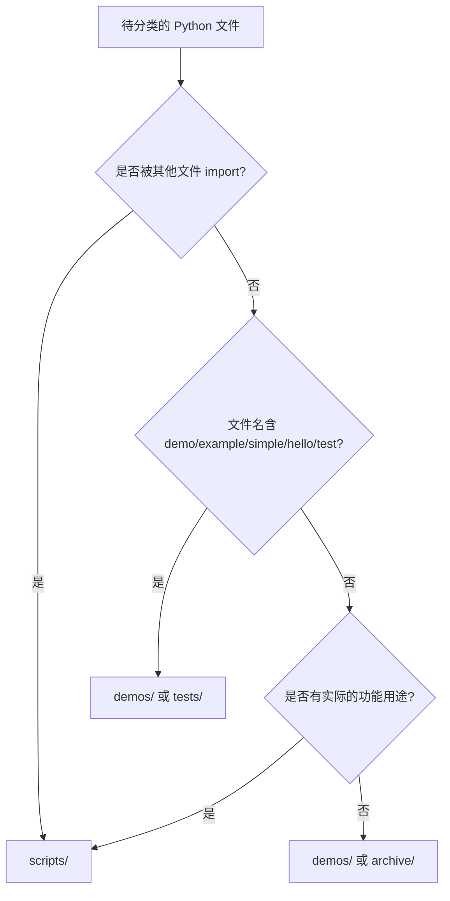
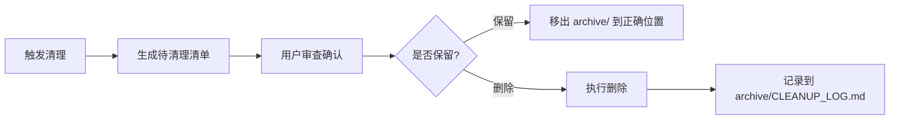

# 设计：整理工作区文件结构（clean-workspace）

## 目标目录结构

```
工作区根目录/
├── README.md                    # 项目说明（保留）
├── .gitignore                   # Git 忽略配置（保留）
├── .copilotcodemodes            # 模式配置（保留）
├── config.json                  # 通用配置（保留）
├── .claude/                     # Claude 配置（不动）
├── .copilotcode/                # Copilot Code 配置（不动）
│
├── scripts/                     # 【新建】实用工具脚本
│   ├── get_current_time.py
│   ├── get_current_time.js
│   ├── get_current_time.ps1
│   ├── add_python_to_path.ps1
│   ├── file_utils.py
│   ├── file_batch_processor.py
│   ├── data_processor.py
│   ├── random_data_generator.py
│   ├── xml_tag_validator.py
│   └── npm_docs_tool.py
│
├── demos/                       # 【新建】示例和演示代码
│   ├── hello_world.py
│   ├── simple_addition.py
│   ├── simple_demo.py
│   ├── demo.py
│   ├── example_code.py
│   ├── example_script.py
│   ├── new_example.py
│   ├── my_new_code.py
│   ├── advanced_math_demo.py
│   ├── calculator.py
│   ├── check_equality.py
│   └── file_utils_examples.py   # ⚠️ 依赖 scripts/file_utils.py，需更新 import
│
├── data-analysis/               # 【新建】数据分析相关
│   ├── analyze_sample_data.py
│   ├── data_analysis.py
│   ├── data_analysis_demo.py
│   ├── data_analysis_report.py
│   ├── data_analysis_simple.py
│   ├── sample_data.csv
│   ├── sample_data.json
│   └── analysis_result.csv
│
├── tests/                       # 【新建】测试文件
│   ├── test_demo.py             # ⚠️ 从 demos/ 移入；依赖 demos/demo.py，需更新 import
│   ├── test_calculator_skill.py
│   ├── test_skills.py
│   ├── test_weather_api.py
│   └── test_weather_mcp.py      # ⚠️ 依赖 weather-mcp-server/server.py（sys.path 已处理）
│
├── docs/                        # 【新建】文档
│   ├── README.md                # 原 README 或索引
│   ├── code_review_report.md
│   ├── data_analysis_report_final.md
│   ├── poetry_creation.md
│   ├── file_type_options.md
│   ├── projects_summary.md
│   ├── SKILLS_SUMMARY.md
│   ├── PROJECT_ISSUES_DETAILED.md
│   ├── PROJECT_ISSUES_SUMMARY.md
│   ├── npm_docs_tool_README.md
│   └── todo_list.md
│
├── docs/mcp/                    # 【新建】MCP 相关文档
│   ├── MCP服务诊断指南.md
│   ├── MCP修复说明.md
│   ├── MCP修复完成报告.md
│   ├── figma-mcp-setup.md
│   ├── Figma_MCP修复说明.md
│   └── Figma启动说明.md
│
├── mcp-config/                  # 【新建】MCP 配置文件
│   ├── converted_mcp.json
│   ├── mcp_settings_fixed.json
│   ├── fix_mcp_config.py
│   ├── fix_figma_mcp.py
│   ├── mcp_stream_fix.py
│   ├── update_figma_key.py
│   └── verify_mcp_config.py
│
├── figma/                       # 【新建】Figma 相关
│   ├── start_figma_mcp.bat
│   ├── start_figma_mcp_background.bat
│   ├── start_figma_mcp_service.vbs
│   ├── stop_figma_mcp.bat
│   └── images/                  # 原 figma_images/
│       └── image_1.png
│
├── custom-tools-mcp/            # MCP 服务器（不动）
├── demo-resources-mcp/          # MCP 服务器（不动）
├── mcp-streaming-server/        # MCP 服务器（不动）
├── weather-mcp-server/          # MCP 服务器（不动）
│
└── archive/                     # 【新建】归档/待清理
    ├── 0KvaHMT.docx
    ├── 请选择文件类型.txt
    ├── 文件类型选择.txt
    ├── 新建 文本文档.txt
    ├── 新建文本文件.txt
    ├── new_file.txt
    ├── notes.txt
    └── temp_delete_test.txt
```

## 设计决策

### 1. 分类原则

| 分类 | 判断依据 |
|------|----------|
| `scripts/` | 具有实际功能的独立工具脚本 |
| `demos/` | 教学/实验/演示性质的代码 |
| `data-analysis/` | 数据处理和分析相关的代码及数据文件 |
| `tests/` | 以 `test_` 开头的测试文件 |
| `docs/` | 所有 `.md` 文档（README 除外） |
| `mcp-config/` | MCP 配置和修复脚本 |
| `figma/` | Figma 相关脚本和资源 |
| `archive/` | 临时文件、无明确用途的文件 |

### 2. 根目录保留的文件

仅保留以下全局性文件：
- `README.md` — 项目入口说明
- `.gitignore` — Git 配置
- `.copilotcodemodes` — 模式配置
- `config.json` — 通用配置

### 3. 不触碰的目录

- `.claude/`、`.copilotcode/` — AI 工具配置
- `custom-tools-mcp/`、`demo-resources-mcp/`、`mcp-streaming-server/`、`weather-mcp-server/` — 已有良好结构的 MCP 服务器
- `spec-changes/` — 本提案自身

### 4. archive 目录的处理策略

`archive/` 中的文件经用户确认后可安全删除。初始阶段先移入归档，不直接删除。

## 文件间依赖分析

实施前需检查：
1. Python 文件之间是否有 `import` 关系（如 `file_utils.py` 是否被其他文件引用）
2. 批处理脚本中是否有硬编码的文件路径
3. 配置文件中是否引用了根目录下的文件路径

### 已发现的依赖关系（实际扫描结果）

| 文件 | 依赖 | 移动后影响 | 修复方案 |
|------|------|------------|----------|
| `file_utils_examples.py` | `from file_utils import FileUtils` | `demos/` → `scripts/` 跨目录 import 断裂 | 见下方方案评估 |
| `test_demo.py` | `from demo import Calculator` | `tests/` → `demos/` 跨目录 import 断裂 | 见下方方案评估 |
| `test_weather_mcp.py` | `sys.path.insert(0, 'weather-mcp-server')` 后 `from server import app` | 路径仍为根目录相对，需改为 `../weather-mcp-server` | 更新 sys.path 中的路径 |

其余 Python 文件均只使用标准库或第三方包，无跨文件依赖，可安全移动。

### 5. Import 修复方案评估

针对跨目录 import 问题，有以下几种方案可选：

| 方案 | 优点 | 缺点 | 适用场景 |
|------|------|------|----------|
| **A. sys.path.insert()** | 无需配置，立即生效 | 不优雅，运行时修改路径，IDE 无法识别 | 临时修复、一次性脚本 |
| **B. pyproject.toml + pip install -e .** | 标准 Python 方式，IDE 友好，import 清晰 | 需要 package 化改造，增加项目复杂度 | 正式项目、长期维护 |
| **C. PYTHONPATH 环境变量** | 简单，无需修改代码 | 依赖环境配置，换机器需重新设置 | 本地开发环境 |
| **D. 相对 import + __init__.py** | Python 原生支持 | 只能在包内使用，不能作为脚本直接运行 | 包内部模块 |

**推荐方案**：采用 **方案 A（sys.path.insert）+ 方案 B（长期优化）** 的渐进策略：

1. **短期（本次整理）**：使用 `sys.path.insert()` 快速修复，确保移动后功能正常
2. **中期（可选优化）**：在根目录创建 `pyproject.toml`，将 `scripts/` 和 `demos/` 声明为包
3. **修复代码模板**：
   ```python
   # 跨目录 import 修复模板（短期方案）
   import os
   import sys
   
   # 添加目标目录到 Python 路径
   _current_dir = os.path.dirname(os.path.abspath(__file__))
   _target_dir = os.path.join(_current_dir, '..', 'scripts')  # 根据实际调整
   if _target_dir not in sys.path:
       sys.path.insert(0, _target_dir)
   
   # 现在可以正常 import
   from file_utils import FileUtils
   ```

### 6. demos/ 与 scripts/ 分类标准

为避免主观判断的模糊性，采用以下**可执行的分类规则**：

| 分类 | 定义 | 判断标准（满足任一） | 示例 |
|------|------|----------------------|------|
| **scripts/** | 实用工具 | ① 被其他文件 import 使用<br>② 提供命令行参数/交互<br>③ 处理真实数据/外部系统<br>④ 文件名为名词（如 `file_utils.py`） | `file_utils.py`, `data_processor.py` |
| **demos/** | 演示代码 | ① 仅用于展示某个概念/功能<br>② 文件名含 demo/example/simple/hello<br>③ 不被其他文件依赖<br>④ 输出为打印/展示性质 | `hello_world.py`, `simple_demo.py` |

**边界案例决策树**：



### 7. archive/ 目录退出策略

`archive/` 是临时归档区，不是永久存储。需要明确的退出机制：

#### 7.1 保留期限

| 文件类型 | 保留期限 | 说明 |
|----------|----------|------|
| 明确的临时文件（如 `temp_*.txt`） | 7 天 | 短期缓冲，快速清理 |
| 来源不明的文件 | 30 天 | 给予足够时间确认 |
| 可能有价值的文件 | 90 天 | 如旧版文档、历史数据 |

#### 7.2 清理触发条件

满足以下**任一条件**时触发清理审查：

1. **时间触发**：文件在 archive/ 中超过对应保留期限
2. **数量触发**：archive/ 中文件数超过 20 个
3. **大小触发**：archive/ 总大小超过 50MB
4. **事件触发**：每次版本发布前

#### 7.3 清理流程



#### 7.4 记录机制

在 `archive/` 目录下维护 `CLEANUP_LOG.md`：

```markdown
# Archive 清理记录

## 2024-XX-XX
- **删除文件**：temp_delete_test.txt, new_file.txt
- **原因**：确认为测试时创建的临时文件
- **操作人**：用户确认

## 2024-XX-XX
- **恢复文件**：notes.txt → docs/notes.md
- **原因**：发现包含有价值的项目笔记
```

### 8. 防止未来混乱的维护机制

整理只是第一步，更重要的是建立**持续维护机制**，防止回到混乱状态。

#### 8.1 README 指南

在根目录 `README.md` 中添加「文件组织指南」章节：

```markdown
## 📁 文件组织指南

新增文件时，请按以下规则放置：

| 文件类型 | 目标目录 | 示例 |
|----------|----------|------|
| 实用工具脚本 | scripts/ | file_utils.py |
| 演示/示例代码 | demos/ | hello_world.py |
| 测试文件 | tests/ | test_xxx.py |
| 数据分析相关 | data-analysis/ | analyze_xxx.py |
| 文档 | docs/ | xxx_report.md |
| MCP 配置 | mcp-config/ | xxx_mcp.json |
| 临时文件 | archive/ | temp_xxx.txt |

⚠️ **请勿在根目录下创建新文件**（除非是全局配置）
```

#### 8.2 .gitignore 增强

添加规则阻止常见临时文件进入版本控制：

```gitignore
# 防止根目录混乱
/*.txt
/*.docx
/temp_*
/新建*
```

#### 8.3 定期检查任务

建议每月执行一次「工作区健康检查」：

1. 检查根目录文件数是否 ≤ 5
2. 检查 archive/ 是否需要清理
3. 检查是否有文件放错目录

可通过以下脚本自动化：

```python
# scripts/workspace_health_check.py
import os
from pathlib import Path

def check_workspace():
    root = Path('.')
    root_files = [f for f in root.iterdir() if f.is_file()]
    
    issues = []
    if len(root_files) > 5:
        issues.append(f"根目录文件过多: {len(root_files)} 个")
    
    archive = root / 'archive'
    if archive.exists():
        archive_files = list(archive.iterdir())
        if len(archive_files) > 20:
            issues.append(f"archive/ 需要清理: {len(archive_files)} 个文件")
    
    return issues
```

#### 8.4 Pre-commit Hook（可选）

如果团队使用 Git，可添加 pre-commit hook 检查：

```yaml
# .pre-commit-config.yaml
repos:
  - repo: local
    hooks:
      - id: check-root-files
        name: Check root directory cleanliness
        entry: python scripts/workspace_health_check.py
        language: python
        always_run: true
```
