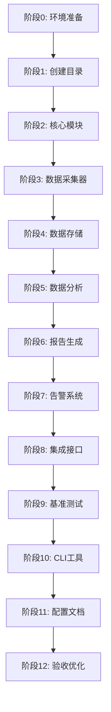

# 任务清单：性能监控系统（performance-monitor）

## 阶段 0：环境准备

- [ ] **0.1** 确认 Python 环境版本 ≥ 3.8
- [ ] **0.2** 创建 `requirements-perf.txt` 性能监控依赖
  ```txt
  psutil>=5.9.0
  pytest-benchmark>=4.0.0
  snakeviz>=2.2.0
  flameprof>=0.4
  pyyaml>=6.0
  jinja2>=3.1.0
  click>=8.1.0
  ```
- [ ] **0.3** 安装依赖：`pip install -r requirements-perf.txt`
- [ ] **0.4** 验证安装
  ```bash
  python -c "import psutil; print(psutil.cpu_percent())"
  ```

## 阶段 1：创建目录结构

- [ ] **1.1** 创建监控模块目录 `perf_monitor/`
- [ ] **1.2** 创建子目录结构
  - `perf_monitor/core/` - 核心功能
  - `perf_monitor/collectors/` - 数据采集器
  - `perf_monitor/storage/` - 数据存储
  - `perf_monitor/analysis/` - 数据分析
  - `perf_monitor/reporting/` - 报告生成
  - `perf_monitor/reporting/templates/` - 报告模板
  - `perf_monitor/alerts/` - 告警系统
  - `perf_monitor/alerts/channels/` - 通知渠道
  - `perf_monitor/integrations/` - 集成接口
- [ ] **1.3** 创建数据目录
  - `perf_data/` - 性能数据存储
  - `perf_data/benchmarks/` - 基准测试数据
  - `perf_data/profiles/` - 剖析数据
- [ ] **1.4** 创建报告目录
  - `perf_reports/` - 报告输出
  - `perf_reports/latest/` - 最新报告
  - `perf_reports/archive/` - 历史报告
- [ ] **1.5** 创建基准测试目录 `benchmarks/`
- [ ] **1.6** 在所有 Python 目录添加 `__init__.py`

## 阶段 2：核心模块开发

### 2.1 计时器模块

- [ ] **2.1.1** 创建 `perf_monitor/core/timer.py`
  - 实现 `TimingResult` 数据类
  - 实现 `Timer` 计时器类
  - 实现 `@timed` 装饰器
  - 支持纳秒精度计时
- [ ] **2.1.2** 添加单元测试 `tests/unit/test_timer.py`
- [ ] **2.1.3** 验证计时精度

### 2.2 资源监控器

- [ ] **2.2.1** 创建 `perf_monitor/core/resource_monitor.py`
  - 实现 `ResourceSnapshot` 数据类
  - 实现 `ResourceMonitor` 监控类
  - CPU、内存、I/O 采集
  - 后台线程采样
- [ ] **2.2.2** 添加单元测试
- [ ] **2.2.3** 测试不同采样间隔

### 2.3 剖析器

- [ ] **2.3.1** 创建 `perf_monitor/core/profiler.py`
  - cProfile 集成
  - 剖析结果处理
  - 热点代码提取
- [ ] **2.3.2** 添加 `@profile` 装饰器
- [ ] **2.3.3** 测试剖析功能

## 阶段 3：数据采集器开发

- [ ] **3.1** 创建 `perf_monitor/collectors/base.py`
  - 定义采集器基类接口
- [ ] **3.2** 创建 `perf_monitor/collectors/cpu_collector.py`
  - CPU 使用率采集
  - 进程 CPU 时间
- [ ] **3.3** 创建 `perf_monitor/collectors/memory_collector.py`
  - 内存使用量采集
  - 内存增量计算
- [ ] **3.4** 创建 `perf_monitor/collectors/io_collector.py`
  - I/O 读写字节数
  - 文件操作计数
- [ ] **3.5** 创建 `perf_monitor/collectors/mcp_collector.py`
  - MCP 请求响应时间
  - 吞吐量统计
  - 错误率计算

## 阶段 4：数据存储层开发

### 4.1 数据模型

- [ ] **4.1.1** 创建 `perf_monitor/storage/schema.py`
  - 定义 `MetricType` 枚举
  - 定义 `MetricPoint` 数据类
  - 定义 `ExecutionRecord` 数据类
  - 定义 `BenchmarkResult` 数据类
  - 定义 `AlertEvent` 数据类

### 4.2 SQLite 存储

- [ ] **4.2.1** 创建 `perf_monitor/storage/sqlite_store.py`
  - 数据库初始化
  - 表结构创建
  - CRUD 操作实现
  - 数据查询接口
- [ ] **4.2.2** 实现数据清理机制
  - 按时间保留策略
  - 自动清理旧数据
- [ ] **4.2.3** 添加索引优化查询

### 4.3 JSON 存储（备用）

- [ ] **4.3.1** 创建 `perf_monitor/storage/json_store.py`
  - 文件写入/读取
  - 日志轮转
- [ ] **4.3.2** 实现数据导入/导出

## 阶段 5：数据分析模块

- [ ] **5.1** 创建 `perf_monitor/analysis/statistics.py`
  - 平均值、中位数、标准差
  - 百分位数计算（p50、p90、p95、p99）
  - 最大/最小值
- [ ] **5.2** 创建 `perf_monitor/analysis/trend.py`
  - 时间序列分析
  - 趋势检测
  - 移动平均
- [ ] **5.3** 创建 `perf_monitor/analysis/anomaly.py`
  - 异常值检测
  - 基于标准差的检测
  - 突变检测
- [ ] **5.4** 创建 `perf_monitor/analysis/comparison.py`
  - 基准对比
  - 版本对比
  - 回归检测

## 阶段 6：报告生成系统

### 6.1 HTML 报告

- [ ] **6.1.1** 创建 `perf_monitor/reporting/templates/report.html`
  - 响应式布局
  - 概览统计卡片
  - 函数执行表格
  - 趋势图表（Chart.js）
  - 告警列表
- [ ] **6.1.2** 创建 `perf_monitor/reporting/html_report.py`
  - Jinja2 模板渲染
  - 数据聚合
  - 报告生成
- [ ] **6.1.3** 测试报告生成
  - 验证 HTML 有效性
  - 验证图表渲染

### 6.2 JSON 导出

- [ ] **6.2.1** 创建 `perf_monitor/reporting/json_export.py`
  - 标准化 JSON 格式
  - 可配置字段
  - 压缩选项

### 6.3 火焰图

- [ ] **6.3.1** 创建 `perf_monitor/reporting/flamegraph.py`
  - 集成 flameprof
  - SVG 火焰图生成
  - 交互式查看

## 阶段 7：告警系统

### 7.1 告警规则

- [ ] **7.1.1** 创建 `perf_monitor/alerts/rules.py`
  - 定义 `Severity` 枚举
  - 定义 `Operator` 枚举
  - 定义 `AlertRule` 数据类
  - 规则评估逻辑
  - 预定义规则集

### 7.2 通知渠道

- [ ] **7.2.1** 创建 `perf_monitor/alerts/channels/log_channel.py`
  - 日志输出通知
  - 级别映射
- [ ] **7.2.2** 创建 `perf_monitor/alerts/channels/email_channel.py`
  - SMTP 邮件发送
  - 邮件模板
- [ ] **7.2.3** 创建 `perf_monitor/alerts/channels/webhook_channel.py`
  - HTTP POST 通知
  - 重试机制

### 7.3 告警管理

- [ ] **7.3.1** 创建 `perf_monitor/alerts/notifier.py`
  - 告警触发逻辑
  - 冷却时间管理
  - 告警聚合
  - 历史记录

## 阶段 8：集成接口

### 8.1 装饰器

- [ ] **8.1.1** 创建 `perf_monitor/integrations/decorators.py`
  - `@track_performance` 装饰器
  - `@profile` 装饰器
  - 配置选项（采样率、标签等）
- [ ] **8.1.2** 编写使用示例
- [ ] **8.1.3** 测试各种场景
  - 同步函数
  - 异步函数
  - 类方法
  - 嵌套调用

### 8.2 上下文管理器

- [ ] **8.2.1** 创建 `perf_monitor/integrations/context_managers.py`
  - `monitor()` 上下文管理器
  - 手动计时支持
- [ ] **8.2.2** 测试上下文管理器

### 8.3 MCP 中间件

- [ ] **8.3.1** 创建 `perf_monitor/integrations/middleware.py`
  - MCP 请求拦截
  - 响应时间记录
  - 错误跟踪
- [ ] **8.3.2** 集成到现有 MCP 服务
  - weather-mcp-server
  - demo-resources-mcp
  - custom-tools-mcp

### 8.4 pytest 插件

- [ ] **8.4.1** 创建 `perf_monitor/integrations/pytest_plugin.py`
  - pytest 钩子实现
  - 测试执行时间报告
  - 与 pytest-benchmark 集成

## 阶段 9：基准测试框架

### 9.1 配置

- [ ] **9.1.1** 创建 `benchmarks/conftest.py`
  - pytest-benchmark 配置
  - 基准线加载/保存
  - 自定义选项
- [ ] **9.1.2** 配置基准对比规则

### 9.2 基准测试用例

- [ ] **9.2.1** 创建 `benchmarks/test_scripts_benchmark.py`
  - file_utils 性能基准
  - data_processor 性能基准
- [ ] **9.2.2** 创建 `benchmarks/test_data_benchmark.py`
  - 数据加载性能
  - 数据转换性能
  - 数据分析性能
- [ ] **9.2.3** 创建 `benchmarks/test_mcp_benchmark.py`
  - MCP 请求响应基准
  - 吞吐量基准

### 9.3 基准线管理

- [ ] **9.3.1** 建立初始基准线
  ```bash
  pytest benchmarks/ --benchmark-save=baseline
  ```
- [ ] **9.3.2** 创建基准对比脚本

## 阶段 10：CLI 工具

- [ ] **10.1** 创建 `perf_monitor/cli.py`
  - `report` 命令 - 生成报告
  - `stats` 命令 - 查看统计
  - `alerts` 命令 - 查看告警
  - `baseline` 命令 - 管理基准线
  - `clean` 命令 - 清理数据
- [ ] **10.2** 添加命令帮助文档
- [ ] **10.3** 创建 CLI 入口脚本
  ```bash
  # 在 setup.py 或 pyproject.toml 中配置
  perf-monitor report --format html
  ```

## 阶段 11：配置与文档

### 11.1 配置文件

- [ ] **11.1.1** 创建 `perf_config.yaml`
  - 全局设置
  - 存储配置
  - 采集配置
  - 告警配置
  - 报告配置
- [ ] **11.1.2** 实现配置加载逻辑
- [ ] **11.1.3** 支持环境变量覆盖

### 11.2 文档

- [ ] **11.2.1** 创建 `perf_monitor/README.md`
  - 快速入门
  - 安装说明
  - 使用示例
- [ ] **11.2.2** 更新项目 README.md
  - 添加性能监控章节
- [ ] **11.2.3** 编写 API 文档（与 api-doc-generator 配合）

## 阶段 12：验收与优化

### 12.1 功能验收

- [ ] **12.1.1** 验收检查清单
  - [ ] 计时器精度 < 1ms
  - [ ] 资源监控数据准确
  - [ ] 存储读写正常
  - [ ] 报告生成完整
  - [ ] 告警触发及时
  - [ ] CLI 命令可用
  - [ ] 基准测试通过

### 12.2 性能验收

- [ ] **12.2.1** 监控开销测试
  - 开启/关闭监控对比
  - 确保开销 < 5%
- [ ] **12.2.2** 存储性能测试
  - 大量数据写入测试
  - 查询响应时间测试

### 12.3 集成验收

- [ ] **12.3.1** 与 auto-test-framework 集成测试
- [ ] **12.3.2** 与现有 MCP 服务集成测试
- [ ] **12.3.3** CI 集成测试

### 12.4 优化

- [ ] **12.4.1** 根据测试结果优化性能
- [ ] **12.4.2** 优化报告生成速度
- [ ] **12.4.3** 优化数据存储效率

---

## 任务执行顺序建议



## 关键里程碑

| 里程碑 | 完成标志 | 预计时间 |
|--------|----------|----------|
| M1: 核心可用 | 阶段 0-2 完成，计时器和资源监控可用 | 4 小时 |
| M2: 数据链路 | 阶段 3-4 完成，数据采集和存储完整 | 6 小时 |
| M3: 分析报告 | 阶段 5-6 完成，可生成性能报告 | 4 小时 |
| M4: 告警集成 | 阶段 7-8 完成，告警和集成可用 | 7 小时 |
| M5: 基准 CLI | 阶段 9-10 完成，基准测试和 CLI 可用 | 4 小时 |
| M6: 完整交付 | 阶段 11-12 完成，全部功能验收 | 3 小时 |

## 风险检查点

- [ ] **检查点 1**（阶段 2 后）：计时精度和资源监控准确性
- [ ] **检查点 2**（阶段 4 后）：数据存储容量和性能
- [ ] **检查点 3**（阶段 7 后）：告警及时性和准确性
- [ ] **检查点 4**（阶段 8 后）：监控开销是否 < 5%
- [ ] **检查点 5**（阶段 12 后）：全部功能验收通过

## 依赖检查

| 依赖项 | 状态 | 备注 |
|--------|------|------|
| auto-test-framework | 待完成 | 基准测试依赖 pytest 基础设施 |
| clean-workspace | 待完成 | 目录结构依赖工作区整理 |
| psutil 库 | 需安装 | 资源监控核心依赖 |
| pytest-benchmark | 需安装 | 基准测试依赖 |

---

**预计总工作量**：28 小时
**建议执行方式**：按阶段顺序执行，里程碑验证
**创建日期**：2026-03-04
